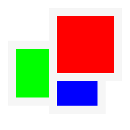
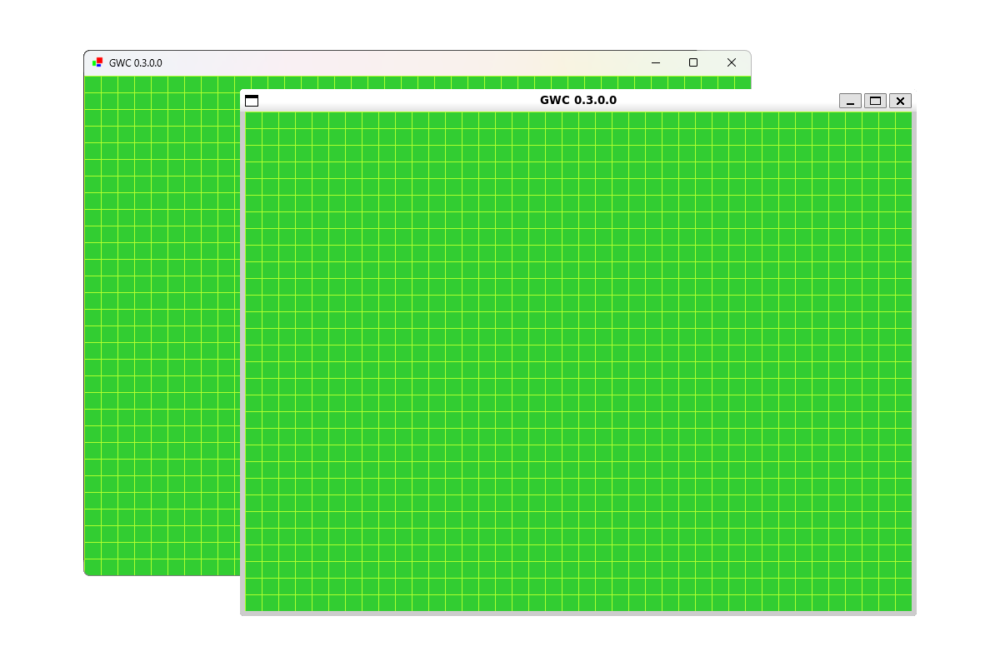
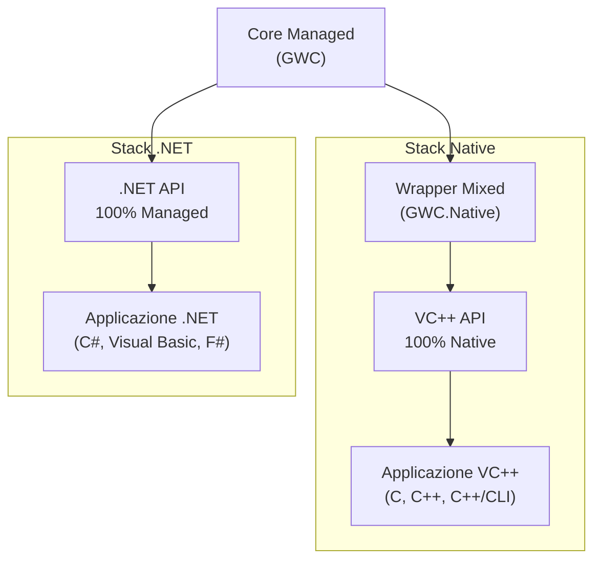

# GWC <br />Graphical Window for Console Apps


🖼️ A C#, C++ and C graphics library written in C#, C++ and C



Caratteristiche:

* 🤪 Folle
* ☠️ Mortale
* 🔬 Sperimentale
* 🪄 Inaffidabile
* 🚀 Ambiziosa
* 📦 Instabile
* 🤤 Goduriosa


# Architettura



## GWC

* Libreria Core Managed con interfaccia API 100% Managed
* Scritta in C#
* Espone l'API .NET

## GWC.Native

* Libreria Wrapper Mixed con interfaccia API 100% Native
* Scritta in C++/CLI, C++ e C
* Espone l'API VC++


# Esempi

* [API C](#api-c)
* [API C++](#api-c-1)


## API C

```c
#include <gwc.h>

#include <stdio.h>

int main(int argc, const char* argv[])
{
    WINDOW* window = window_new(800, 600);

    window_open(window);

    if (!window_isInitialized(window))
    {
        window_delete(window);

        return 1;
    }

    bool loop = true;

    printf("Press \"ESC\" to exit...\n");

    while (window_isOpen(window) && loop)
    {
        gKEYS modifiers = gKEYS_NONE;
        gKEYS key = gKEYS_NONE;

        bool keyDown = window_consumeKeyDown(window, &modifiers, &key);

        if (keyDown)
        {
            if (key == gKEYS_ESCAPE)
            {
                loop = false;

                continue;
            }
        }

        window_wait(window, 100);
    }

    if (window_isOpen(window))
    {
        window_close(window);
    }

    window_delete(window);

    exit(0);
}
```


## API C++

```cpp
#include <gwc.hpp>

#include <iostream>

using namespace gwc;

using namespace std;

int main(int argc, const char* argv[])
{
    Window* window = new Window(800, 600);

    window->open();

    if (!window->isInitialized())
    {
        delete window;

        return 1;
    }

    bool loop = true;

    cout << "Press \"ESC\" to exit..." << endl;

    while (window->isOpen() && loop)
    {
        gKeys modifiers = gKeys::None;
        gKeys key = gKeys::None;

        bool keyDown = window->consumeKeyDown(modifiers, key);

        if (keyDown)
        {
            if (key == gKeys::Escape)
            {
                loop = false;

                continue;
            }
        }

        window->wait(100);
    }

    if (window->isOpen())
    {
        window->close();
    }

    delete window;

    exit(0);
}
```


# Utilizzo

* [Windows](#windows)
* [Linux/macOS](#linuxmacos)


## Windows

### Requisiti

* .NET
  * .NET 10 Desktop Runtime
  * .NET Framework 4.8.1 Runtime
  * .NET Framework 4.7.2 Runtime
* Microsoft Visual C++
  * Microsoft Visual C++ v14 Redistributable


## Linux/macOS

### Requisiti

> [!WARNING]
> `GWC` è supportata su Linux/macOS tramite `Mono`.

* Mono Runtime 6.12.0

> [!WARNING]
> `GWC.Native` è supportata su Linux/macOS tramite `Wine`.

* Wine 10


# Download

| Mirror     | Url                                                          |
| :--------- | :----------------------------------------------------------: |
| GitHub     | [Download](https://github.com/reallukee/gwc/releases/latest) |


# Compilazione

* [Windows](#windows-1)
* [Linux/macOS](#linuxmacos-1)


## Windows

### 1. Prerequisiti

* `git`
* [Visual Studio 2026](https://aka.ms/vs/stable/vs_Community.exe)
  oppure
  [Build Tools per Visual Studio 2026](https://aka.ms/vs/stable/vs_BuildTools.exe)

In Visual Studio Installer:

* Sviluppo per Desktop .NET
  * .NET 10 SDK
  * .NET Framework 4.8.1 Targeting Pack
  * .NET Framework 4.8.1 SDK
  * .NET Framework 4.7.2 Targeting Pack
  * .NET Framework 4.7.2 SDK
* Sviluppo di Applicazioni Desktop con C++
  * Supporto a C++/CLI (Ultima Versione)
  * Strumenti di Compilazione MSVC per x64/x86 (Ultima Versione)
  * Strumenti di Compilazione MSVC per ARM64/ARM64EC (Ultima Versione)

### 2. Sorgente

```
git clone https://github.com/reallukee/gwc.git
```

### 3. Configurazione

```cmd
REM Visual Studio 2026
CALL "%PROGRAMFILES%\Microsoft Visual Studio\18\Community\Common7\Tools\vsdevcmd"

REM Build Tools per Visual Studio 2026
CALL "%PROGRAMFILES% (x86)\Microsoft Visual Studio\18\BuildTools\Common7\Tools\vsdevcmd"
```

```cmd
CD gwc
```

### 4. Compilazione

```cmd
REM GWC
msbuild gwc.sln /t:gwc /p:Configuration=Release /p:Platform=x86
msbuild gwc.sln /t:gwc /p:Configuration=Release /p:Platform=x64
msbuild gwc.sln /t:gwc /p:Configuration=Release /p:Platform=ARM64

REM GWC.Mono
msbuild gwc.sln /t:gwc_mono /p:Configuration=Release /p:Platform=x86
msbuild gwc.sln /t:gwc_mono /p:Configuration=Release /p:Platform=x64

REM GWC.Native
msbuild gwc.sln /t:gwc_native /p:Configuration=Release /p:Platform=x64
msbuild gwc.sln /t:gwc_native /p:Configuration=Release /p:Platform=x86
msbuild gwc.sln /t:gwc_native /p:Configuration=Release /p:Platform=ARM64
```


## Linux/macOS

### 1. Prerequisiti

* `git`
* `mono`

### 2. Sorgente

```
git clone https://github.com/reallukee/gwc.git
```

### 3. Configurazione

```bash
cd gwc
```

### 4. Compilazione

```bash
# GWC.Mono
msbuild gwc.sln /t:gwc_mono /p:Configuration=Release /p:Platform=x86
msbuild gwc.sln /t:gwc_mono /p:Configuration=Release /p:Platform=x64
```


# Autore

* [Luca Pollicino](https://github.com/reallukee)


# Licenza

Licenza [MIT](./LICENSE)
