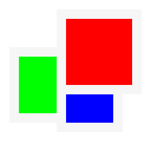
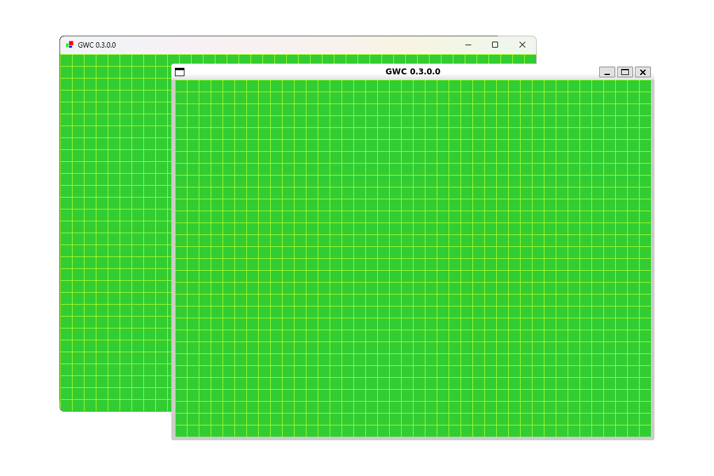
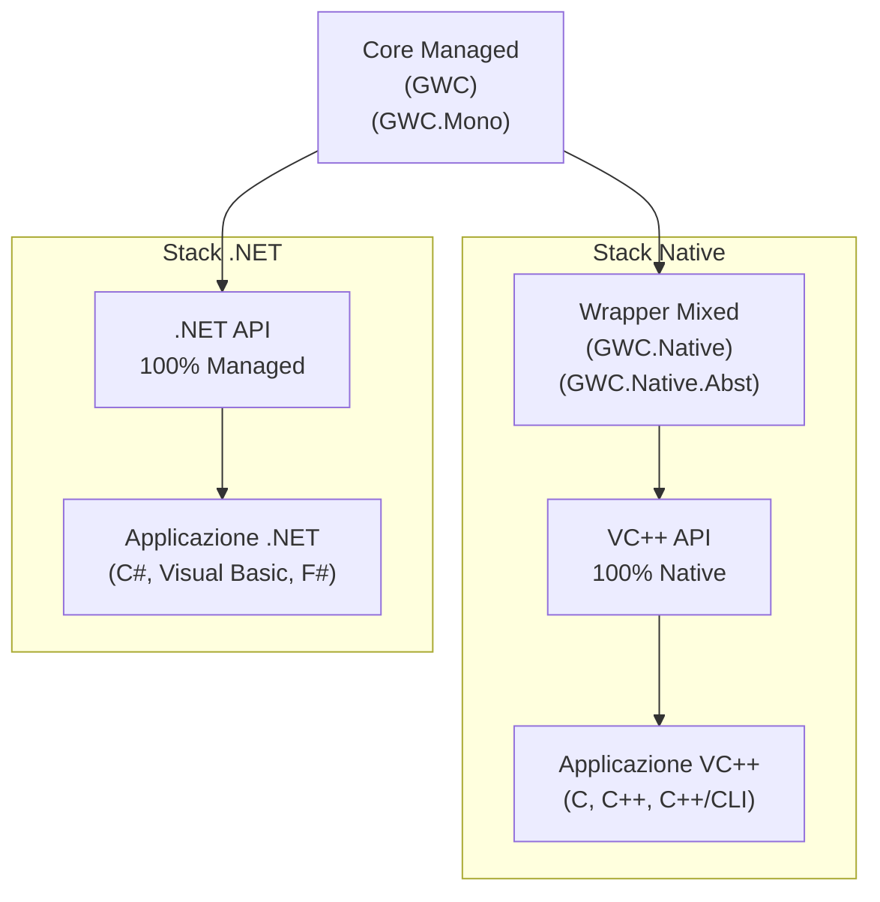

# GWC<br /> Graphical Window for Console Apps


🖼️ A C#, C++ and C graphics library written in C#, C++ and C



Caratteristiche:

* 🤪 Folle
* ☠️ Mortale
* 🔬 Sperimentale
* 🪄 Inaffidabile
* 🚀 Ambiziosa
* 📦 Instabile
* 🤤 Goduriosa


# Architettura


```mermaid
graph TD
  Core["Core Managed<br />(GWC)<br />(GWC.Mono)"]

  subgraph Stack.Native["Stack Native"]
    Native["Wrapper Mixed<br />(GWC.Native)<br />(GWC.Native.Abst)"]

    VC++.API["VC++ API<br />100% Native"]

    VC++.App["Applicazione VC++<br />(C, C++, C++/CLI)"]

    Native --> VC++.API

    VC++.API --> VC++.App
  end

  subgraph Stack..NET["Stack .NET"]
    .NET.API[".NET API<br />100% Managed"]

    .NET.App["Applicazione .NET<br />(C#, Visual Basic, F#)"]

    .NET.API --> .NET.App
  end

  Core --> Native
  Core --> .NET.API
```

> Approssimativa!

## GWC

* Libreria Core Managed con interfaccia API 100% Managed
* Scritta in C#
* Espone l'API .NET

## GWC.Mono

* Libreria Mono Managed con interfaccia API 100% Managed
* Scritta in C#
* Espone l'API .NET

## GWC.Native

* Libreria Wrapper Mixed con interfaccia API 100% Native
* Scritta in C++/CLI, C++ e C
* Espone l'API VC++

## GWC.Native.Abst

* Libreria Wrapper Mixed con interfaccia API 100% Native
* Scritta in C++/CLI, C++ e C
* Espone l'API VC++


# Organizzazione

```
.vscode/             Configurazione Visual Studio Code
assets/              Assets
config/              Config Scripts v1
config2/             Config Scripts v2
docs/                Documentazione
examples/            Esempi
gwc/                 Codice sorgente Core
gwc.dev/             Modalità dev Core
gwc.native/          Codice sorgente Nativo
gwc.native.dev/      Modalità dev Nativo
gwc.native.abst/     Codice sorgente Nativo Abst
gwc.native.abst.dev/ Modalità dev Nativo Abst
scripts/             Scripts v1
scripts2/            Scripts v2
templates/           Template
```


# Esempi

* [API C](#api-c)
  * [GWC.Native](#gwcnative-1)
  * [GWC.Native.Abst](#gwcnativeabst-1)
* [API C++](#api-c-1)
  * [GWC.Native](#gwcnative-2)
  * [GWC.Native.Abst](#gwcnativeabst-2)


## API C

### GWC.Native

```c
#include <gwc.h>

int main(int argc, const char* argv[])
{
    render_init();

    WINDOW* window = window_new(800, 600);

    window_open(window);

    if (!window_isInitialized(window))
    {
        window_delete(window);

        render_shutdown();

        return 1;
    }

    bool loop = true;

    while (window_isOpen(window) && loop)
    {
        gKEYS modifiers = gKEYS_NONE;
        gKEYS key = gKEYS_NONE;

        bool keyDown = window_consumeKeyDown(window, &modifiers, &key);

        if (keyDown)
        {
            if (key == gKEYS_ESCAPE)
            {
                loop = false;

                continue;
            }
        }

        window_wait(window, 100);
    }

    if (window_isOpen(window))
    {
        window_close(window);
    }

    window_delete(window);

    render_shutdown();

    return 0;
}
```


### GWC.Native.Abst

```c
#include <gwc.h>

#include <gwc_abst.h>

int main(int argc, const char* argv[])
{
    render_init();
    wndmgr_init();

    WINDOW_ID window = wndmgr_alloc(800, 600, true);

    wndmgr_open();

    if (!wndmgr_isInitialized())
    {
        render_shutdown();
        wndmgr_shutdown();

        return 1;
    }

    bool loop = true;

    while (wndmgr_isOpen() && loop)
    {
        gKEYS modifiers = gKEYS_NONE;
        gKEYS key = gKEYS_NONE;

        bool keyDown = wndmgr_consumeKeyDown(&modifiers, &key);

        if (keyDown)
        {
            if (key == gKEYS_ESCAPE)
            {
                loop = false;

                continue;
            }
        }

        wndmgr_wait(100);
    }

    if (wndmgr_isOpen())
    {
        wndmgr_close();
    }

    render_shutdown();
    wndmgr_shutdown();

    return 0;
}
```


## API C++

### GWC.Native

```cpp
#include <gwc.hpp>

using namespace gwc;

int main(int argc, const char* argv[])
{
    Render::init();

    Window* window = new Window(800, 600);

    window->open();

    if (!window->isInitialized())
    {
        delete window;

        Render::shutdown();

        return 1;
    }

    bool loop = true;

    while (window->isOpen() && loop)
    {
        gKeys modifiers = gKeys::None;
        gKeys key = gKeys::None;

        bool keyDown = window->consumeKeyDown(modifiers, key);

        if (keyDown)
        {
            if (key == gKeys::Escape)
            {
                loop = false;

                continue;
            }
        }

        window->wait(100);
    }

    if (window->isOpen())
    {
        window->close();
    }

    delete window;

    Render::shutdown();

    return 0;
}
```


### GWC.Native.Abst

```cpp
#include <gwc.hpp>

using namespace gwc;

#include <gwc_abst.hpp>

using namespace gwc_abst;

int main(int argc, const char* argv[])
{
    Render::init();
    WndMgr::init();

    WindowId window = WndMgr::alloc(800, 600, true);

    WndMgr::open();

    if (!WndMgr::isInitialized())
    {
        Render::shutdown();
        WndMgr::shutdown();

        return 1;
    }

    bool loop = true;

    while (WndMgr::isOpen() && loop)
    {
        gKeys modifiers = gKeys::None;
        gKeys key = gKeys::None;

        bool keyDown = WndMgr::consumeKeyDown(modifiers, key);

        if (keyDown)
        {
            if (key == gKeys::Escape)
            {
                loop = false;

                continue;
            }
        }

        WndMgr::wait(100);
    }

    if (WndMgr::isOpen())
    {
        WndMgr::close();
    }

    Render::shutdown();
    WndMgr::shutdown();

    return 0;
}
```


# Utilizzo

* [Windows](#windows)
* [Linux/macOS](#linuxmacos)


## Windows

### Requisiti

* .NET
  * .NET 10 Desktop Runtime
  * .NET Framework 4.8.1 Runtime
  * .NET Framework 4.7.2 Runtime
* Microsoft Visual C++
  * Microsoft Visual C++ v14 Redistributable


## Linux/macOS

### Requisiti

> [!WARNING]
> `GWC` è supportata su Linux/macOS tramite `Mono`.<br />
> `GWC.Mono` è supportata su Linux/macOS tramite `Mono`.

* Mono Runtime 6.12.0

> [!WARNING]
> `GWC.Native` è supportata su Linux/macOS tramite `Wine`.<br />
> `GWC.Native.Abst` è supportata su Linux/macOS tramite `Wine`.

* Wine 10


# Download

| Mirror                  | Url                                                          |
| :---------------------- | :----------------------------------------------------------: |
| GitHub                  | [Download](https://github.com/reallukee/gwc/releases/latest) |
| Altervista (`Rilascio`) | [Download](https://reallukee.altervista.org/gwc)             |
| Altervista (`Snapshot`) | [Download](https://reallukee.altervista.org/gwc/snapshot)    |


# Compilazione

* [Windows](#windows-1)
* [Linux/macOS](#linuxmacos-1)


## Windows

### 1. Prerequisiti

* `git`
* [Visual Studio 2026](https://aka.ms/vs/stable/vs_Community.exe)
  oppure
  [Build Tools per Visual Studio 2026](https://aka.ms/vs/stable/vs_BuildTools.exe)

In Visual Studio Installer:

* Sviluppo per Desktop .NET
  * .NET 10 SDK
  * .NET Framework 4.8.1 Targeting Pack
  * .NET Framework 4.8.1 SDK
  * .NET Framework 4.7.2 Targeting Pack
  * .NET Framework 4.7.2 SDK
* Sviluppo di Applicazioni Desktop con C++
  * Supporto a C++/CLI (Ultima Versione)
  * Strumenti di Compilazione MSVC per x64/x86 (Ultima Versione)
  * Strumenti di Compilazione MSVC per ARM64/ARM64EC (Ultima Versione)

### 2. Sorgente

```
git clone https://github.com/reallukee/gwc.git
```

### 3. Configurazione

```cmd
CD gwc

CD scripts
```

### 4. Compilazione

```cmd
.\build_all.cmd
```

### 5. Pulizia (*Opzionale*)

```bash
.\clear_all.cmd
```


## Linux/macOS

### 1. Prerequisiti

* `git`
* `mono`

### 2. Sorgente

```
git clone https://github.com/reallukee/gwc.git
```

### 3. Configurazione

```bash
cd gwc

cd scripts
```

### 4. Compilazione

```bash
chmod +x build_all.sh

./build_all.sh
```

### 5. Pulizia (*Opzionale*)

```bash
chmod +x clear_all.sh

./clear_all.sh
```


# Autore

* [Luca Pollicino](https://github.com/reallukee)


# Licenza

Licenza [MIT](./LICENSE)
