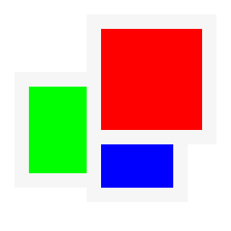
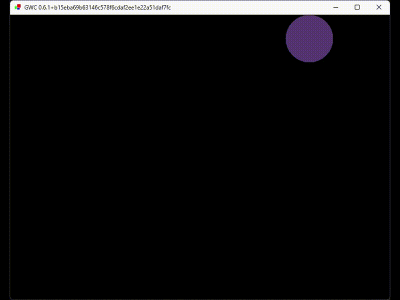
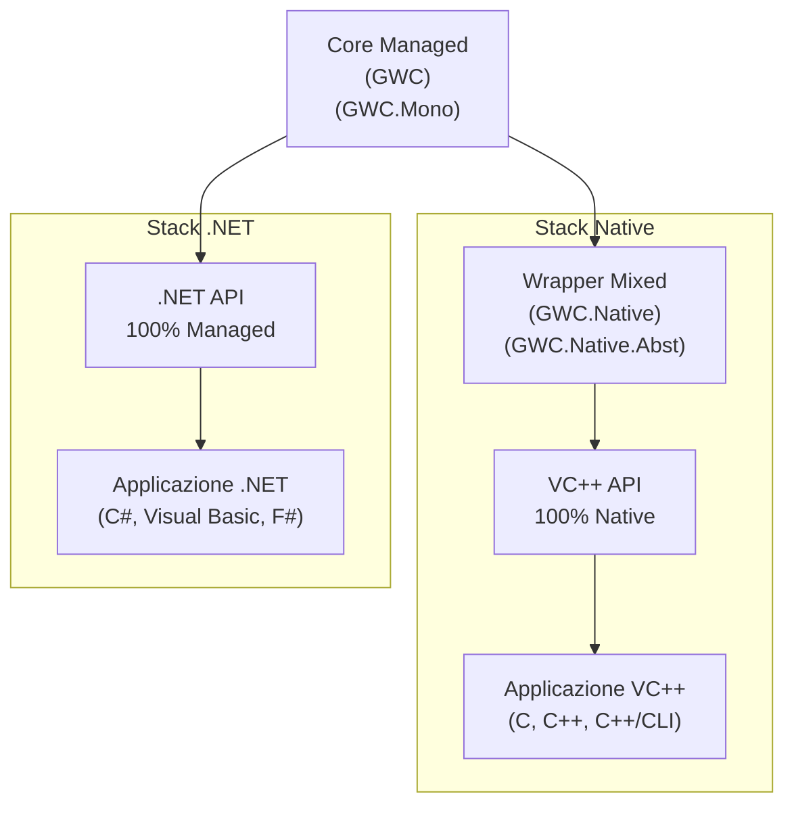

# GWC<br /> Graphical Window for Console Apps


🖼️ A C#, C++ and C graphics library written in C#, C++ and C

> [!NOTE]
> GWC 0.7.0 OUT NOW 🥳!
>
> [📦 Release!](https://github.com/reallukee/gwc/releases/tag/v0.7.0)

> [!IMPORTANT]
> GWC 0.8.0
>
> .NET FX ➡️ .NET Core

<div align="center">



</div>

Caratteristiche:

* 🤪 `Folle`
* ☠️ `Mortale`
* 🔬 `Sperimentale`
* 🪄 `Inaffidabile`
* 🚀 `Ambiziosa`
* 🔥 `Instabile`
* 🤤 `Goduriosa`


# Architettura


```mermaid
graph TD
  Core["Core Managed<br />(GWC)<br />(GWC.Mono)"]

  subgraph Stack.Native["Stack Native"]
    Native["Wrapper Mixed<br />(GWC.Native)<br />(GWC.Native.Abst)"]

    VC++.API["VC++ API<br />100% Native"]

    VC++.App["Applicazione VC++<br />(C, C++, C++/CLI)"]

    Native --> VC++.API

    VC++.API --> VC++.App
  end

  subgraph Stack..NET["Stack .NET"]
    .NET.API[".NET API<br />100% Managed"]

    .NET.App["Applicazione .NET<br />(C#, Visual Basic, F#)"]

    .NET.API --> .NET.App
  end

  Core --> Native
  Core --> .NET.API
```

> Approssimativa!


# Organizzazione

```
.vscode/             Configurazione Visual Studio Code
assets/              Assets
config/              Config Scripts v1
config2/             Config Scripts v2
docs/                Documentazione
examples/            Esempi
gwc/                 Codice Sorgente Core
gwc.dev/             Modalità Sviluppo Core
gwc.native/          Codice Sorgente Nativo
gwc.native.dev/      Modalità Sviluppo Nativo
gwc.native.abst/     Codice Sorgente Nativo Abst
gwc.native.abst.dev/ Modalità Sviluppo Nativo Abst
scripts/             Scripts v1
scripts2/            Scripts v2
templates/           Templates
vs/                  Visual Studio
```


# Esempi

* [API C](#api-c)
  * [GWC.Native](#gwcnative-1)
  * [GWC.Native.Abst](#gwcnativeabst-1)
* [API C++](#api-c-1)
  * [GWC.Native](#gwcnative-2)
  * [GWC.Native.Abst](#gwcnativeabst-2)


## API C

### GWC.Native

```c
#include <gwc.h>

int main(int argc, const char* argv[])
{
    render_init();

    WINDOW* window = window_new(800, 600);

    window_open(window);

    if (!window_clrIsInit(window))
    {
        window_delete(window);

        render_shutdown();

        return 1;
    }

    bool loop = true;

    while (window_isOpen(window) && loop)
    {
        gKEYS modifiers = gKEYS_NONE;
        gKEYS key = gKEYS_NONE;

        bool keyDown = window_consumeKeyDown(window, &modifiers, &key);

        if (keyDown)
        {
            if (key == gKEYS_ESCAPE)
            {
                loop = false;

                continue;
            }
        }

        window_wait(window, 16);
    }

    if (window_isOpen(window))
    {
        window_close(window);
    }

    window_delete(window);

    render_shutdown();

    return 0;
}
```


### GWC.Native.Abst

```c
#include <gwc.h>

#include <gwc_abst.h>

int main(int argc, const char* argv[])
{
    render_init();
    wndmgr_init();

    WINDOW_ID window = wndmgr_alloc(800, 600, true);

    wndmgr_open();

    if (!wndmgr_clrIsInit())
    {
        render_shutdown();
        wndmgr_shutdown();

        return 1;
    }

    bool loop = true;

    while (wndmgr_isOpen() && loop)
    {
        gKEYS modifiers = gKEYS_NONE;
        gKEYS key = gKEYS_NONE;

        bool keyDown = wndmgr_consumeKeyDown(&modifiers, &key);

        if (keyDown)
        {
            if (key == gKEYS_ESCAPE)
            {
                loop = false;

                continue;
            }
        }

        wndmgr_wait(16);
    }

    if (wndmgr_isOpen())
    {
        wndmgr_close();
    }

    render_shutdown();
    wndmgr_shutdown();

    return 0;
}
```


## API C++

### GWC.Native

```cpp
#include <gwc.hpp>

using namespace gwc;

int main(int argc, const char* argv[])
{
    Render::init();

    Window* window = new Window(800, 600);

    window->open();

    if (!window->clrIsInit())
    {
        delete window;

        Render::shutdown();

        return 1;
    }

    bool loop = true;

    while (window->isOpen() && loop)
    {
        gKeys modifiers = gKeys::None;
        gKeys key = gKeys::None;

        bool keyDown = window->consumeKeyDown(modifiers, key);

        if (keyDown)
        {
            if (key == gKeys::Escape)
            {
                loop = false;

                continue;
            }
        }

        window->wait(16);
    }

    if (window->isOpen())
    {
        window->close();
    }

    delete window;

    Render::shutdown();

    return 0;
}
```


### GWC.Native.Abst

```cpp
#include <gwc.hpp>

using namespace gwc;

#include <gwc_abst.hpp>

using namespace gwc_abst;

int main(int argc, const char* argv[])
{
    Render::init();
    WndMgr::init();

    WindowId window = WndMgr::alloc(800, 600, true);

    WndMgr::open();

    if (!WndMgr::clrIsInit())
    {
        Render::shutdown();
        WndMgr::shutdown();

        return 1;
    }

    bool loop = true;

    while (WndMgr::isOpen() && loop)
    {
        gKeys modifiers = gKeys::None;
        gKeys key = gKeys::None;

        bool keyDown = WndMgr::consumeKeyDown(modifiers, key);

        if (keyDown)
        {
            if (key == gKeys::Escape)
            {
                loop = false;

                continue;
            }
        }

        WndMgr::wait(16);
    }

    if (WndMgr::isOpen())
    {
        WndMgr::close();
    }

    Render::shutdown();
    WndMgr::shutdown();

    return 0;
}
```


# Utilizzo

> Zzz... Zzz... Zzz...


# Download

### GitHub

* [Download](https://github.com/reallukee/gwc/releases/latest)

### Altervista

* [Download](https://reallukee.altervista.org/gwc)


# Compilazione

> Zzz... Zzz... Zzz...


# Autore

* [Luca Pollicino](https://github.com/reallukee)


# Licenza

Licenza [MIT](./LICENSE)
